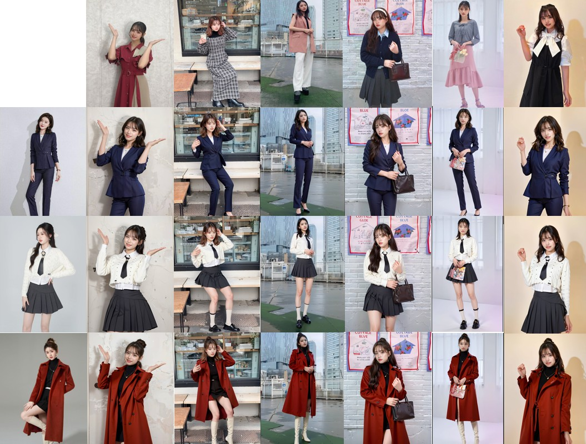

<div align="center">
<h1>Outfit Anyone in the Wild: Get rid of Annoying Restrictions for Virtual Try-on Task</h1>

<a href='https://huggingface.co/spaces/selfit-camera/OutfitAnyone-in-the-Wild'></a>
[](https://www.modelscope.cn/studios/selfitcamera/OutfitAnyoneInTheWild/summary)
[](https://openxlab.org.cn/apps/detail/jiangxiaoguo/OutfitAnyone-in-the-Wild)

</div>

OutfitAnyone in the Wild is a new state-of-the-art virtual try-on method to produce high-quality try-on result on street photos. It achievies a perfect balance between user's face ID retention and clothing detail consistency.




<!-- ### Comparison with Previous Works

<p align="center">
  
</p>

Comparison with existing tuning-free state-of-the-art techniques. InstantID achieves better fidelity and retain good text editability (faces and styles blend better).
 -->

## Abstract
Virtual Try-On task aims to transfer an in-shop garment image onto a target person. Existing methods focus on improving metrics on the fitting data set, they often overlook the diversity of user poses and complexity of environments in street photos. In addition, how to maintain the consistency of user IDs and clothing style details is also a more tricky topic. All the above problems prevent virtual try-on tasks from being implemented in real scenes and online e-commerce. 

In this paper, we propose OutfitAnyone in-the-wild, which achieves a perfect balance between image harmony, clothing detail consistency, and user's face ID retention.
We first model human bodies in the user's photo and clothing photo through our pre-trained human body reconstruction large model. Then deformation on posture and figure is performed in parameter space to match the user's picture. As a part of our human body parametric model, clothing appearance follows the deformation of the human body, and changes under physical laws, so that they can fit the user's human body harmoniously. The rendered image will finally go through a detect-and-refine network that can repair discordant factors in human body images. 

Extensive experiments on an in-the-wild test set demonstrate the superiority of our method, surpassing state-of-the-art methods both qualitatively and quantitatively


## Api Usage Tips
- Get your own ```openId``` and ```apiKey``` in WeChat applet **SelfitCamera (赛飞相机)**
- Create your clothing model in WeChat applet **SelfitCamera (赛飞相机)**, record its ```clothId``` in details page.
- Upload your pose image with function ```upload_pose_img```, then public a cloth swap task ```publicClothSwap```
- Get result with ```getInfRes```


## Acknowledgements
- [openpose](https://github.com/CMU-Perceptual-Computing-Lab/openpose) 
- [M3D-VTON](https://github.com/fyviezhao/M3D-VTON) 
- [GP-VTON](https://github.com/xiezhy6/GP-VTON) 
- [OutfitAnyone](https://github.com/HumanAIGC/OutfitAnyone) 
- [InstantID](https://github.com/InstantID/InstantID) 
- [street-tryon](https://github.com/cuiaiyu/street-tryon-benchmark) 
- [MeshGraphormer](https://github.com/microsoft/MeshGraphormer) 
- [HuggingFace](https://github.com/huggingface)
- [ModelScope](https://github.com/modelscope/modelscope) 

For any question, please feel free to contact us via jiangxiaoguo@selfitcamera.cn
